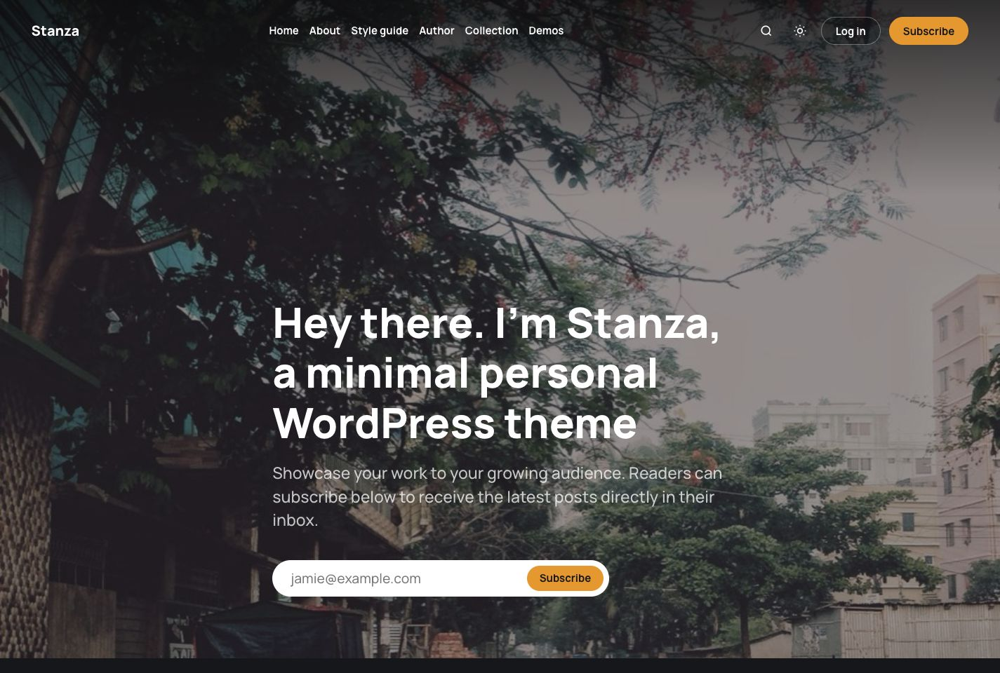
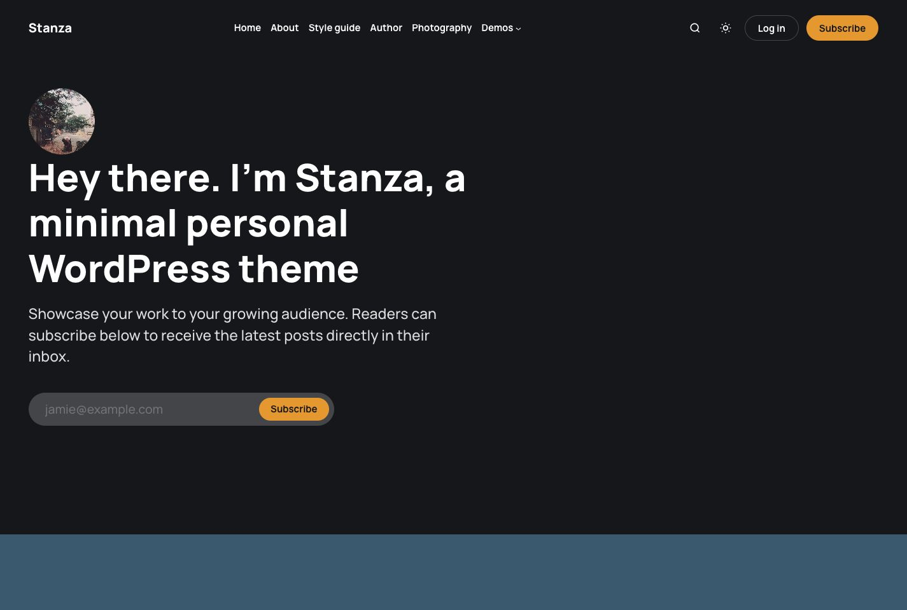
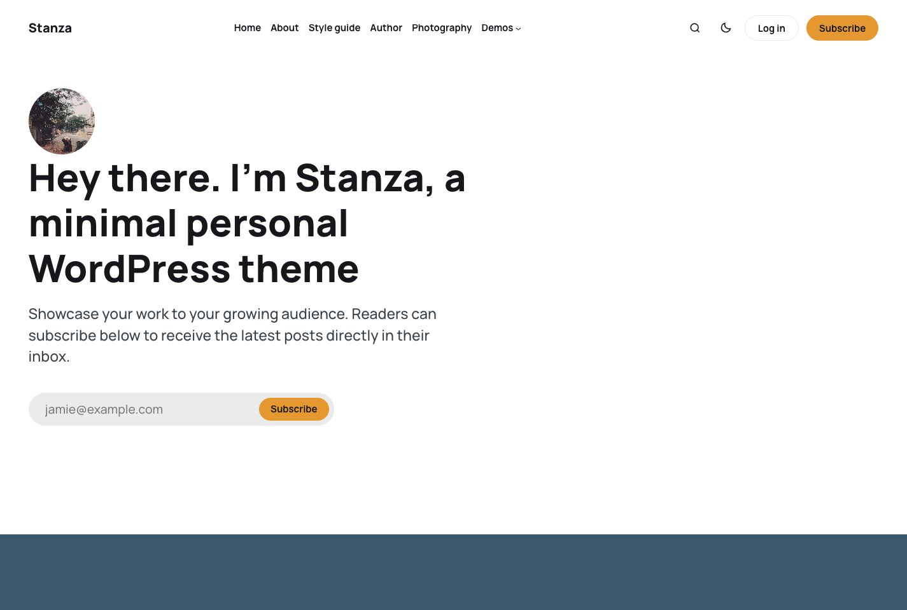
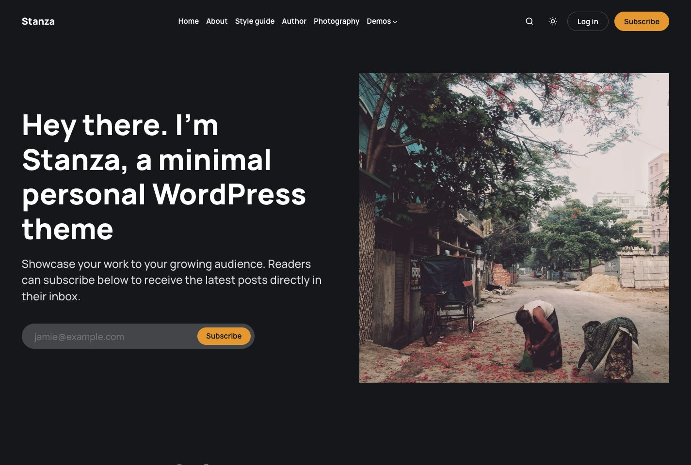
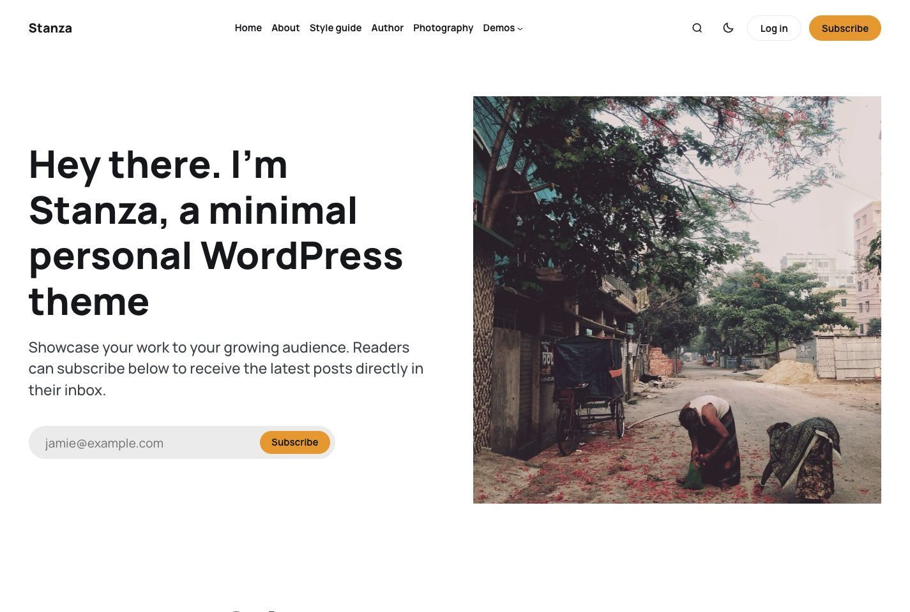
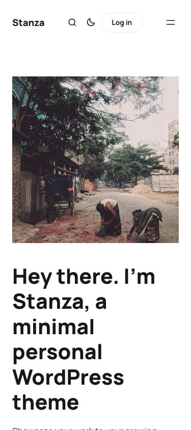
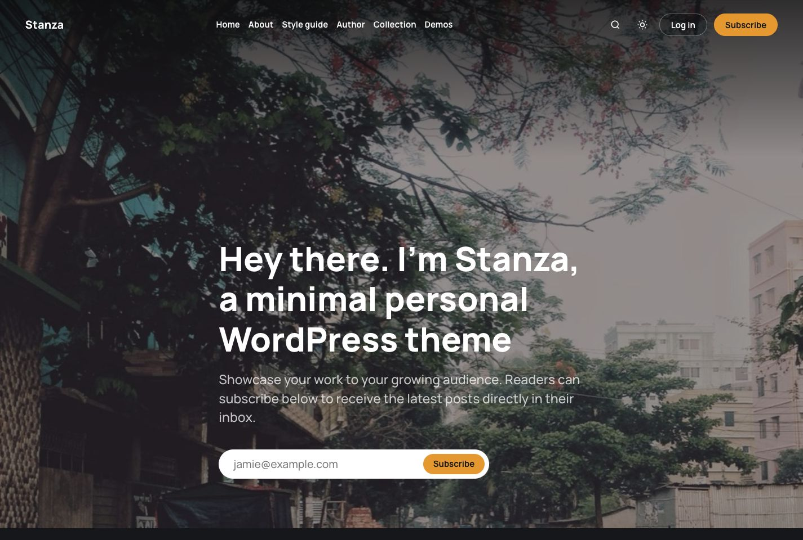
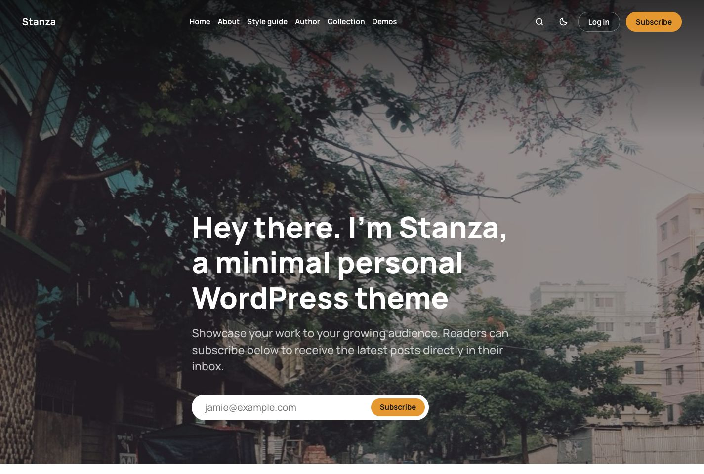
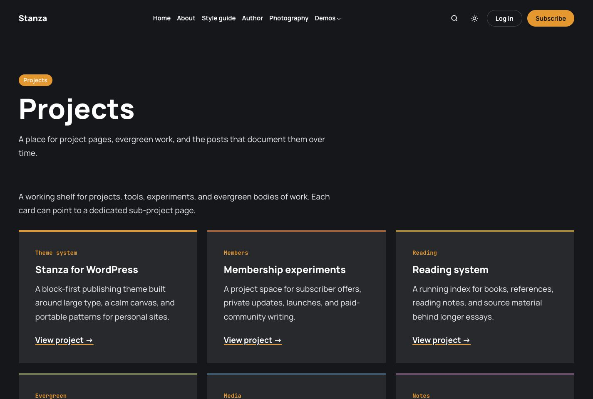
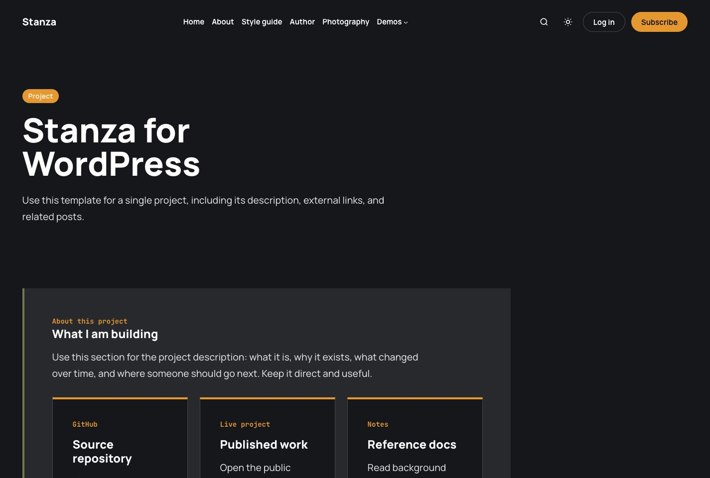

# Stanza

Stanza is a minimal, type-forward WordPress block theme for personal publishing.



## Installable ZIP

The repository root is the theme root. To build an installable ZIP from a clone:

```bash
git archive --format=zip --prefix=stanza/ HEAD -o stanza.zip
```

Upload `stanza.zip` in WordPress at **Appearance > Themes > Add New > Upload Theme**.

## Theme Structure

- `theme.json` is the single source of truth: every color, font size, font family, spacing step, radius, and shadow exists exactly once, as a preset. The neutral palette is built on CSS `light-dark()` pairs, so dark mode needs no JavaScript.
- `templates/` contains block templates for home, posts, pages, archives, search, author, tag, 404, projects, and the style guide.
- `parts/` contains reusable header, overlay header, and footer template parts.
- `patterns/` contains hero, feed, subscribe CTA, and project block patterns.
- `styles/` contains dark, light, serif, and mono style variations.
- `blocks/` contains four build-less custom blocks (block.json + render.php + Interactivity API view modules): color mode toggle, subscribe form, parallax card, and an accessible mobile nav drawer.
- `assets/css/blocks/` contains one stylesheet per core block type, loaded on demand with `wp_enqueue_block_style()` — there is no monolithic stylesheet.
- `assets/` contains local fonts, icons, and imagery.

See `CSS-REPORT.md` for every hand-written CSS rule and why it exists, and `DRIFT-LOG.md` for the intentional differences from v1.

## Home Template Variants

The default `Front Page` template keeps the background hero and classic feed. Additional page templates are included for alternate pattern combinations:

- `Home: Profile + Parallax Feed`
- `Home: Side Hero + Typographic Feed`
- `Home: Background Hero + Typographic Feed`

Create or edit a page, choose one of these templates in the page settings, and publish it to preview or use that composition.

### Profile + Parallax Feed





### Side Hero + Typographic Feed







### Background Hero + Typographic Feed





## Project Templates

Stanza includes a `Projects Index` page template and a `Project Detail` page template.

Use `Projects Index` for the main Projects page. It includes the `Project index` pattern: square-cornered project cards with an orange eyebrow, an H3 title, body copy, and a link to the project sub-page.

Use `Project Detail` for individual project pages. The template renders the page title, the page content, and a related-posts section filtered to the `projects` category slug. For the editable project description and external links, insert the `Project detail content` pattern into the page content and update the links for that project.





### Project Card Accents

Project cards are Group blocks using the **Project card** block style. The accent bar is the block's own top border: select the card, open **Border**, and pick any palette color (Brand accent, Clay, Mustard, Sage, Petrol, Plum). No helper classes are needed — the v1 `st-project-card is-*` class map was removed in 2.0.

Suggested meanings:

- Brand accent: Featured, primary, or newest project.
- Clay: Members, subscriptions, or commercial work.
- Mustard: Reading, references, books, or source material.
- Sage: Projects and evergreen content.
- Petrol: Photography, media, travel, or visual archives.
- Plum: Notes, personal logs, or process writing.

## Category Accents

Stanza includes a small category accent map in `assets/css/blocks/core-post-terms.css`, keyed by category slug. The theme adds `stanza-category-{slug}` classes to rendered category links, so accents work whether the site uses pretty permalinks or plain `?cat=ID` category URLs.

For update-safe custom category accents, add rules in **Site Editor > Styles > Additional CSS**, a child theme, or a small site plugin — never by editing the installed parent theme files:

```css
.taxonomy-category .stanza-category-new-slug {
	--stanza-category-accent: var(--wp--preset--color--tag-sage);
}
```

A child theme should be packaged and installed as its own theme with its own theme folder and `style.css` header. Do not bundle a child theme inside the Stanza parent theme ZIP and expect WordPress to install both themes automatically.

## Newsletter and Subscription Forms

The hero and CTA patterns use the `stanza/subscribe-form` block — a pill email capture with a pluggable provider slot. A newsletter or membership plugin owns the actual signup, list sync, double opt-in, and consent behavior; without a provider the form renders disabled and says so. It never pretends to subscribe anyone.

Provider slot priority:

1. **`stanza_subscribe_form_html` filter** — return any provider's form markup (Jetpack Forms, Mailchimp embed, a membership modal trigger) and the block wraps it in the pill styling:

   ```php
   add_filter( 'stanza_subscribe_form_html', fn () => $my_form_markup );
   ```

2. **MailPoet** — with MailPoet active, return a form id from the `stanza_mailpoet_form_id` filter and the block renders that form, normalized to the pill look:

   ```php
   add_filter( 'stanza_mailpoet_form_id', fn () => 3 );
   ```

3. **Native form action** — set the block's "Form action URL" attribute to a real endpoint (e.g. a list provider's POST URL).

## Code Blocks

Stanza styles the core WordPress Code block for readable monospace text, horizontal scrolling, and a small orange accent rule. The theme intentionally does not provide syntax parsing, copy-to-clipboard controls, or Gist/GitHub embed behavior.

Use a code-focused plugin for those features so highlighted code, copy buttons, and external code embeds remain available if the site changes themes. A good plugin should render accessible controls, support common language classes such as `language-php` or `language-js`, and leave normal GitHub or Gist URLs as clean links or embeds in post content.

## Privacy

Stanza does not include tracking or analytics. The color mode toggle stores a local browser preference in `localStorage` under the key `stanza-color-mode`; this value is not sent to the site owner or any third party by the theme.

## Local Development

This theme was tested against WordPress Studio and WordPress 7.0. Use Studio WP-CLI from the site root:

```bash
studio wp theme activate stanza
```

## Licensing

Stanza is licensed under the GNU General Public License v2.0 or later (`GPL-2.0-or-later`), matching the recommended license for WordPress themes.

Solo by Ghost Foundation is acknowledged in `THIRD-PARTY-NOTICES.md` as MIT-licensed design inspiration only. Stanza is independent and is not a port, copy, fork, or derivative of Solo.
